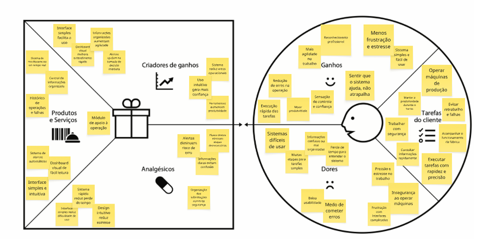

# OPM - Operação de Máquinas

## Introdução

O **OPM (Operação de Máquinas)** é uma aplicação web desenvolvida para otimizar a gestão da produção industrial, centralizando informações relacionadas à operação de máquinas, segurança dos operadores e acompanhamento da eficiência produtiva.

**Repositório GitHub:** *(https://github.com/ICEI-PUC-Minas-PMGES-TI/pmg-es-2026-1-ti1-0438100-opm.git)*

## Integrantes da equipe

- [Bernardo Vinhal](https://github.com/bernardovinhal)
- [Daniel Rolando](https://github.com/TaroNukem)
- [Francisco Cortes](https://github.com/chicortes)
- [Guilherme Luiz](https://github.com/GuilhermeChebile)
- [Leonardo Pettersen](https://github.com/leopettersen)
- [Lucca Xavier](https://github.com/Lucca-Xavier)
- [Vitor Sepulveda](https://github.com/vladeias)

---

# Contexto do Projeto

## Problema

Em ambientes industriais, a rotina operacional depende de processos organizados para garantir produtividade e segurança. Entretanto, muitas empresas ainda utilizam checklists em papel ou sistemas descentralizados para registrar inspeções, treinamentos e indicadores de produção.

Essa falta de integração dificulta o acompanhamento da eficiência das máquinas, aumenta a possibilidade de falhas operacionais e reduz a confiabilidade das informações utilizadas pelos gestores na tomada de decisões.

Além disso, a ausência de um controle centralizado pode ocasionar atrasos na produção, aumento dos custos de manutenção e maior risco de acidentes decorrentes do não cumprimento dos procedimentos de segurança.

## Objetivo do Projeto

### Objetivo Geral

Desenvolver um software web capaz de centralizar informações operacionais e de segurança, oferecendo uma plataforma que auxilie operadores e gestores no acompanhamento da produção industrial.

### Objetivos Específicos

- Digitalizar os checklists de inspeção das máquinas.
- Disponibilizar treinamentos rápidos para operadores.
- Apresentar indicadores de eficiência (OEE) em tempo real.
- Centralizar o gerenciamento de usuários conforme suas funções.
- Facilitar a tomada de decisão através de informações organizadas.

## Justificativa

O gerenciamento eficiente das operações industriais impacta diretamente na produtividade e nos custos das empresas.

Ao substituir processos manuais por uma plataforma digital, espera-se reduzir erros de preenchimento, eliminar perdas de documentos físicos e disponibilizar informações em tempo real para gestores e operadores.

A escolha do projeto também possibilita aprofundar conhecimentos sobre desenvolvimento web, integração entre interface e banco de dados, autenticação de usuários e visualização de indicadores industriais.

## Público-Alvo

A aplicação foi desenvolvida para empresas do setor industrial.

### Operadores

- Conhecimento básico em informática;
- Utilizam computadores ou tablets durante o trabalho;
- Precisam realizar checklists rapidamente;
- Consultam treinamentos quando necessário.

### Gestores de Produção

- Responsáveis pelo acompanhamento dos indicadores;
- Realizam cadastros de usuários;
- Monitoram produtividade e desempenho das máquinas.

### Equipe de Manutenção

- Consulta os registros dos checklists;
- Identifica falhas recorrentes;
- Programa manutenções preventivas.

---

# Processo de Product Discovery

## Matriz CSD

### Certezas

- Checklists físicos podem ser perdidos.
- Paradas inesperadas geram prejuízos.
- A digitalização facilita o armazenamento das informações.

### Suposições

- Operadores utilizarão o sistema caso ele seja mais rápido que o processo em papel.
- Gestores preferirão dashboards atualizados automaticamente.

### Dúvidas

- Qual será a resistência dos operadores mais experientes?
- Qual o melhor dispositivo para utilização na fábrica?
- Os treinamentos rápidos serão suficientes para reduzir erros operacionais?

## Mapa de Stakeholders

| Stakeholder | Papel |
|-------------|-------|
| Operadores | Utilizar checklists e treinamentos |
| Gestores | Monitorar indicadores e produtividade |
| Manutenção | Consultar histórico das máquinas |
| Administradores | Gerenciar usuários e permissões |

## Entrevistas Qualitativas

Foram realizadas entrevistas informais com pessoas que possuem contato com ambientes industriais para compreender dificuldades relacionadas ao uso de checklists físicos e ao acompanhamento da produção.

### Perguntas realizadas

- Como os checklists são feitos atualmente?
- Quais dificuldades existem no processo?
- Como ocorre o treinamento de novos operadores?
- Quais informações são mais importantes para os gestores?

## Highlights da Pesquisa

Os principais pontos identificados foram:

- Necessidade de eliminar documentos em papel.
- Facilidade de acesso aos dados da produção.
- Interface simples para reduzir o tempo de preenchimento.
- Visualização rápida dos indicadores de desempenho.

## Personas

### Persona 1 — Operador Proativo

| Característica | Informação |
|---------------|------------|
| Nome | Carlos |
| Idade | 29 anos |
| Cargo | Operador de Máquina |

**Objetivo**

Realizar rapidamente o checklist diário e iniciar sua produção sem atrasos.

**Dores**

- Perda de tempo com formulários.
- Falta de acesso rápido aos treinamentos.

---

### Persona 2 — Gestor Analítico

| Característica | Informação |
|---------------|------------|
| Nome | Mariana |
| Idade | 42 anos |
| Cargo | Gestora de Produção |

**Objetivo**

Monitorar a eficiência das máquinas e identificar gargalos da produção.

**Dores**

- Informações descentralizadas.
- Dificuldade para acompanhar indicadores em tempo real.

---

# Processo de Product Design

## Histórias de Usuário

### Operador

- Como operador, quero realizar o checklist da máquina antes de iniciar meu turno para garantir segurança.
- Como operador, quero acessar treinamentos rápidos para esclarecer dúvidas durante o trabalho.

### Gestor

- Como gestor, quero visualizar o OEE das máquinas para identificar gargalos na produção.
- Como gestor, quero cadastrar operadores para controlar o acesso ao sistema.

## Proposta de Valor

### Produtos e Serviços

- Sistema web para gerenciamento operacional.
- Dashboard de indicadores.
- Checklist digital.
- Portal de treinamentos.
- Cadastro de usuários.

### Benefícios

- Redução de erros.
- Melhor organização.
- Aumento da produtividade.
- Informações centralizadas.
- Mais segurança operacional.



## Requisitos do Projeto

### Requisitos Funcionais

| Código | Descrição |
|---------|-----------|
| RF01 | Permitir login de usuários. |
| RF02 | Permitir cadastro de usuários. |
| RF03 | Realizar checklists digitais. |
| RF04 | Exibir indicadores OEE. |
| RF05 | Disponibilizar treinamentos. |
| RF06 | Registrar histórico de inspeções. |

### Requisitos Não Funcionais

| Código | Descrição |
|---------|-----------|
| RNF01 | Interface responsiva. |
| RNF02 | Sistema seguro com autenticação. |
| RNF03 | Banco de dados confiável. |
| RNF04 | Tempo de resposta inferior a 2 segundos. |
| RNF05 | Compatibilidade com navegadores modernos. |

---

# Projeto de Interface

## Fluxo do Usuário

```text
Login
   │
   ▼
Página Inicial
   │
   ├── Dashboard
   ├── Checklist
   ├── Produção
   ├── Treinamentos
   └── Administração
```

# Projeto de Interfaces

### Protótipo completo / Wireframe

https://www.figma.com/design/CNkfetUjhWQKAP0sK5NebE/Wireframe-OTM

# Metodologia

## Ferramentas

| Ferramenta | Utilização |
|------------|------------|
| Visual Studio Code | Desenvolvimento |
| GitHub | Versionamento |
| GitHub Projects | Kanban |
| Figma | Protótipos |
| Miro | Design Thinking |
| WhatsApp | Comunicação |

## Organização da Equipe

O projeto foi desenvolvido utilizando a metodologia ágil **Scrum**, com divisão das atividades em sprints semanais.

As tarefas foram distribuídas entre os membros da equipe considerando suas habilidades, envolvendo desenvolvimento Front-end, Back-end, documentação, testes e prototipação.

Reuniões periódicas foram realizadas para acompanhamento do progresso e redefinição das prioridades quando necessário.

## Organização da Equipe

O projeto foi desenvolvido utilizando a metodologia ágil **Scrum**, com divisão das atividades em sprints semanais.

# Sprint 1

Na **Sprint 1**, cada integrante ficou responsável por uma funcionalidade essencial da aplicação, conforme a divisão abaixo:

| Integrante | Funcionalidade |
|------------|----------------|
| Bernardo Vinhal | Apresentação do Status das Máquinas |
| Daniel Gomes | Quadro de Avisos |
| Francisco Côrtes | Cadastro de Novos Usuários |
| Guilherme Chebile | Login |
| Leonardo Federici | Checklist de Máquinas/Operador |
| Lucca Xavier | Cadastro de Máquinas/Peças |
| Vitor Ladeia | Listagem de Peças |

# Sprint 2

Na **Sprint 2**, cada integrante ficou responsável por uma funcionalidade específica da aplicação, conforme a divisão abaixo:

| Integrante | Funcionalidade |
|------------|----------------|
| Bernardo Vinhal | Status de Treinamento |
| Daniel Rolando | Página de Treinamentos |
| Francisco Côrtes | Página de Relatório para Operário |
| Guilherme Chebile | Saúde das Máquinas |
| Leonardo Pettersen | Acesso às Respostas dos Checklists |
| Lucca Xavier | Página de Relatório de Produção de Máquinas |
| Vitor Ladeia | Planejamento da Produção |

As tarefas foram acompanhadas por meio do GitHub Projects utilizando um quadro Kanban, permitindo o acompanhamento do andamento das atividades e da evolução do projeto durante a Sprint.

## Quadro Kanban

O gerenciamento das tarefas foi realizado utilizando o **GitHub Projects**, organizado nas colunas:

- Backlog
- A Fazer
- Em Desenvolvimento
- Em Revisão
- Concluído

---

# Solução Implementada

## Funcionalidades

### Login

**Descrição**

Permite autenticar operadores e administradores.

**Estrutura de Dados**

Usuário.

**Como utilizar**

Informar e-mail e senha cadastrados.

---

### Cadastro de Usuários

Permite cadastrar operadores e administradores do sistema.

---

### Checklist

Permite registrar a inspeção obrigatória antes da utilização da máquina.

---

### Dashboard OEE

Exibe indicadores de eficiência da produção em tempo real.

---

### Portal de Treinamentos

Disponibiliza conteúdos para capacitação dos operadores.

---

# Estruturas de Dados

## Usuário

```json
{
  "id": 1,
  "nome": "Carlos Silva",
  "email": "carlos@email.com",
  "perfil": "Operador"
}
```

## Checklist

```json
{
  "id": 5,
  "maquina": "Torno CNC",
  "oleo": true,
  "ferramentas": true,
  "epi": true,
  "data": "2026-06-10"
}
```

## Indicador OEE

```json
{
  "maquina": "Torno CNC",
  "disponibilidade": 95,
  "performance": 92,
  "qualidade": 98,
  "oee": 85.6
}
```

---

# Módulos e APIs

## Frameworks e Bibliotecas

- HTML5
- CSS3
- JavaScript
- Node.js *(caso utilizado)*

## APIs

- API REST para autenticação.
- API de gerenciamento de usuários.
- API para indicadores de produção.

---

# Referências Bibliográficas

- SOMMERVILLE, Ian. **Engenharia de Software**. Pearson.
- PRESSMAN, Roger. **Engenharia de Software**. McGraw-Hill.
- https://developer.mozilla.org/
- https://nodejs.org/
- https://help.figma.com/
- https://github.com/
